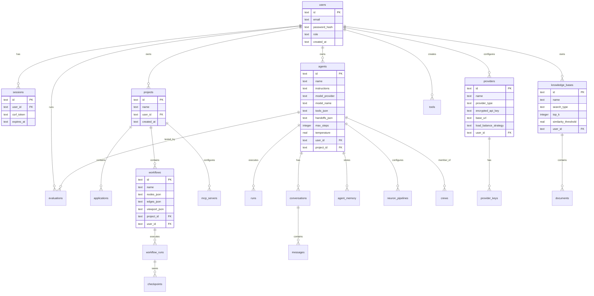

# Orbiter Web — System Architecture

This document describes the architecture of **Orbiter Web**, the full-stack AI agent platform built as a single deployable unit combining an Astro 5.x frontend with a FastAPI backend.

## High-Level Architecture

```
┌─────────────────────────────────────────────────────────────┐
│                        Browser                              │
│  ┌──────────────────────┐  ┌─────────────────────────────┐  │
│  │   Astro 5.x Pages    │  │   React Islands (Canvas)    │  │
│  │  (SSG + client JS)   │  │  (ReactFlow, client:only)   │  │
│  └──────────┬───────────┘  └──────────────┬──────────────┘  │
│             │  fetch /api/v1/*             │                 │
│             │  WebSocket /api/v1/ws        │                 │
└─────────────┼─────────────────────────────┼─────────────────┘
              │                             │
    ┌─────────▼─────────────────────────────▼─────────┐
    │              Vite Dev Proxy (:4321)              │
    │          /api/* → localhost:8000                 │
    └─────────────────────┬───────────────────────────┘
                          │
    ┌─────────────────────▼───────────────────────────┐
    │             FastAPI (uvicorn :8000)              │
    │                                                 │
    │  ┌────────────────────────────────────────────┐  │
    │  │            Middleware Stack                 │  │
    │  │  CORS → Security → Rate Limit → CSRF →     │  │
    │  │  API Version Redirect                      │  │
    │  └────────────────────────────────────────────┘  │
    │                                                 │
    │  ┌──────────────┐  ┌────────────────────────┐  │
    │  │  REST Routes  │  │  WebSocket Endpoint    │  │
    │  │  /api/v1/*    │  │  /api/v1/ws            │  │
    │  │  (45+ routers)│  │  (multiplexed channels)│  │
    │  └──────┬───────┘  └───────────┬────────────┘  │
    │         │                      │                │
    │  ┌──────▼──────────────────────▼────────────┐  │
    │  │           Service Layer                   │  │
    │  │  AgentService · Scheduler · RunQueue ·    │  │
    │  │  MemoryService · Sandbox · Evaluators ·   │  │
    │  │  DocumentProcessor · Audit · Cleanup      │  │
    │  └──────────────────┬───────────────────────┘  │
    │                     │                           │
    │  ┌──────────────────▼───────────────────────┐  │
    │  │        SQLite (WAL mode, aiosqlite)       │  │
    │  │  69 migrations · FTS5 full-text search    │  │
    │  │  Foreign keys ON · Row factory            │  │
    │  └──────────────────────────────────────────┘  │
    │                                                 │
    │  ┌──────────────────────────────────────────┐  │
    │  │         Orbiter Framework Bridge          │  │
    │  │  orbiter-core · orbiter-models            │  │
    │  │  (Agent, Tool, ModelProvider)             │  │
    │  └──────────────────────────────────────────┘  │
    └─────────────────────────────────────────────────┘
              │                     │
    ┌─────────▼───────┐   ┌────────▼──────────┐
    │  File Storage    │   │  LLM Providers    │
    │  data/uploads/   │   │  OpenAI, Anthropic│
    │  data/artifacts/ │   │  Gemini, Vertex,  │
    │                  │   │  Ollama (local)    │
    └──────────────────┘   └───────────────────┘
```

## Frontend: Astro 5.x

The frontend is a statically-generated Astro 5.x application with TypeScript strict mode.

**Key choices:**
- **Tailwind CSS v4** via `@tailwindcss/vite` (not `@astrojs/tailwind`)
- **React islands** for interactive components (workflow canvas uses ReactFlow with `client:only="react"`)
- **No SPA router** — standard Astro page-based routing with `<PageLayout>` providing the app shell (sidebar, top bar, breadcrumbs)
- **Theme system** — light/dark via `data-theme` attribute on `<html>`, detected before first paint via blocking inline script
- **Fonts** — Bricolage Grotesque (via @fontsource) for body, Junicode (woff2) for display headings

**Page structure:**
```
src/pages/
├── index.astro              # Landing / dashboard
├── login.astro              # Auth (uses BaseLayout, not PageLayout)
├── projects/                # Project management
├── agents/                  # Agent configuration & editing
├── workflows/               # Visual workflow canvas
├── playground.astro         # Agent chat playground
├── tools/                   # Tool catalog & schema editor
├── knowledge/               # Knowledge base & RAG
├── crews/                   # Multi-agent crews
├── monitoring/              # Runs, logs, costs, alerts, health
├── evaluations.astro        # Agent evaluation
├── deployments.astro        # Deployment management
├── plugins/                 # Plugin marketplace
├── settings.astro           # User settings
└── docs/                    # Embedded documentation
```

**Layout hierarchy:**
- `BaseLayout.astro` — HTML shell, global styles, theme detection, scroll animations
- `PageLayout.astro` — App shell with sidebar + top bar + breadcrumbs + auth redirect; all app pages use this

## Backend: FastAPI

The backend is a Python FastAPI application (`orbiter_web.app:app`) run via uvicorn.

### Application Lifecycle

```python
@asynccontextmanager
async def lifespan(app):
    _validate_startup()       # Check secret key, DB path
    await run_migrations()    # Apply pending SQL migrations
    await start_scheduler()   # Cron-based workflow scheduling
    await start_cleanup()     # Periodic session/data cleanup
    await start_mcp_health()  # MCP server health monitoring
    yield
    await stop_mcp_health()
    await stop_cleanup()
    await stop_scheduler()
```

### Middleware Stack

Middleware is applied in reverse order (last added = first executed):

| Order | Middleware | Purpose |
|-------|-----------|---------|
| 1 | `APIVersionRedirectMiddleware` | Redirects `/api/*` to `/api/v1/*` (301) |
| 2 | `CSRFMiddleware` | Validates `X-CSRF-Token` on POST/PUT/DELETE |
| 3 | `RateLimitMiddleware` | Sliding-window rate limiting per IP/endpoint |
| 4 | `SecurityHeadersMiddleware` | CSP, X-Content-Type-Options, X-Frame-Options |
| 5 | `CORSMiddleware` | Cross-origin requests (if `ORBITER_CORS_ORIGINS` set) |

### Configuration

All settings are loaded from environment variables via `orbiter_web.config.Settings`:

| Variable | Default | Description |
|----------|---------|-------------|
| `ORBITER_DATABASE_URL` | `sqlite+aiosqlite:///orbiter.db` | Database connection string |
| `ORBITER_SECRET_KEY` | `change-me-in-production` | Encryption key for API keys and sessions |
| `ORBITER_DEBUG` | `false` | Debug mode |
| `ORBITER_SESSION_EXPIRY_HOURS` | `72` | Session lifetime |
| `ORBITER_RATE_LIMIT_AUTH` | `5` | Auth endpoint rate limit (per minute) |
| `ORBITER_RATE_LIMIT_GENERAL` | `60` | General API rate limit (per minute) |
| `ORBITER_RATE_LIMIT_AGENT` | `10` | Agent execution rate limit (per minute) |
| `ORBITER_MAX_UPLOAD_MB` | `50` | Maximum file upload size |
| `ORBITER_UPLOAD_DIR` | `data/uploads/` | Upload storage directory |
| `ORBITER_ARTIFACT_DIR` | `data/artifacts/` | Artifact storage directory |
| `ORBITER_CLEANUP_INTERVAL_HOURS` | `6` | Cleanup task interval |
| `ORBITER_CORS_ORIGINS` | (empty) | Comma-separated allowed origins |

## Database Schema

Orbiter Web uses **SQLite** with WAL (Write-Ahead Logging) mode and foreign keys enabled, accessed via `aiosqlite`.

### Schema Overview (Mermaid ER Diagram)



### Key Tables by Domain

| Domain | Tables |
|--------|--------|
| **Identity** | `users`, `sessions`, `password_resets` |
| **Organization** | `projects`, `applications` |
| **Agents** | `agents`, `agent_templates`, `agent_memory`, `agent_memory_summary`, `neuron_pipelines` |
| **Providers** | `providers`, `provider_keys`, `models`, `model_pricing` |
| **Workflows** | `workflows`, `workflow_runs`, `workflow_approvals`, `checkpoints` |
| **Tools** | `tools`, `plugins` |
| **Knowledge** | `knowledge_bases`, `documents`, `vector_store_config` |
| **Conversations** | `conversations`, `messages`, `threads`, `message_edits`, `annotations` |
| **Execution** | `runs`, `run_queue`, `sandbox_configs` |
| **Monitoring** | `logs`, `alert_rules`, `alerts`, `cost_budgets`, `audit_log` |
| **Evaluation** | `evaluations`, `eval_results`, `benchmarks`, `safety_evaluations` |
| **Deployment** | `deployments`, `api_keys`, `schedules`, `webhooks` |
| **Content** | `prompt_templates`, `prompt_versions`, `prompt_optimizations`, `artifacts`, `artifact_versions` |
| **Integrations** | `mcp_servers`, `observability_integrations`, `notification_templates` |
| **Settings** | `workspace_settings`, `retention_settings`, `config_versions` |
| **Search** | `search_agents`, `search_workflows`, `search_knowledge_bases` (FTS5) |

### Migration System

Migrations are sequential `.sql` files in `orbiter_web/migrations/`:
```
001_create_users.sql
002_create_projects.sql
...
069_create_observability_integrations.sql
```

Tracked in a `_migrations` table. Applied automatically on app startup via `run_migrations()`.

## WebSocket Multiplexing Architecture

All real-time features share a **single WebSocket connection** per client at `ws://host/api/v1/ws`.

### Channel Protocol

Messages follow a typed envelope format:

```json
{
  "channel": "chat | execution | logs | sandbox | notifications | system",
  "type": "<message-type>",
  "payload": { ... }
}
```

### Channels

| Channel | Purpose | Message Types |
|---------|---------|---------------|
| `system` | Connection lifecycle | `connected`, `ping`, `pong`, `subscribed`, `unsubscribed`, `error` |
| `chat` | Agent conversations | `token`, `done`, `error`, `takeover_ack`, `takeover_event` |
| `execution` | Workflow/agent runs | `node_started`, `node_completed`, `execution_completed`, `variables` |
| `logs` | Real-time log streaming | `log_entry` |
| `sandbox` | Code execution results | `sandbox_result` (stdout, stderr, files, images) |
| `notifications` | User notifications | `notification` |

### Connection Flow

```
Client                                Server
  │                                      │
  │─── WebSocket connect ──────────────→│
  │    (orbiter_session cookie)          │
  │                                      │ Validate session
  │                                      │ Auto-subscribe to "system"
  │←── {system, connected, user_id} ────│
  │                                      │
  │─── {type: subscribe, channel: chat}→│
  │←── {system, subscribed, chat} ──────│
  │                                      │
  │←── {system, ping} ─────────────────│ Every 30s
  │─── {type: pong} ───────────────────→│ Must reply within 10s
  │                                      │
  │←── {chat, token, {text: "..."}} ───│ Streamed responses
  │←── {chat, done, {}} ──────────────│
```

### Authentication

WebSocket authentication extracts the `orbiter_session` cookie manually (no FastAPI `Depends()` for WebSocket). Unauthorized connections receive close code `4001`.

## Agent Runtime Bridge (AgentService)

The `AgentService` in `services/agent_runtime.py` bridges database agent configurations to live Orbiter framework objects:

```
┌─────────────────────────────────────────────┐
│              Database (agents table)         │
│  name, instructions, model_provider,        │
│  model_name, tools_json, max_steps, ...     │
└──────────────────┬──────────────────────────┘
                   │
                   ▼
┌──────────────────────────────────────────────┐
│              AgentService                     │
│                                              │
│  1. _load_agent_row(agent_id)                │
│     → SELECT * FROM agents WHERE id = ?      │
│                                              │
│  2. _resolve_provider(type, model, user_id)  │
│     → Look up provider + decrypt API key     │
│     → get_provider("openai:gpt-4o", key=...) │
│                                              │
│  3. _resolve_tools(tools_json, ...)          │
│     → Load tool schemas from tools table     │
│     → Create FunctionTool wrappers           │
│                                              │
│  4. Agent(name=..., model=..., tools=...)    │
│     → Return configured orbiter.Agent        │
└──────────────────┬──────────────────────────┘
                   │
                   ▼
┌──────────────────────────────────────────────┐
│            orbiter.Agent.run()                │
│  → ModelProvider.complete() or .stream()     │
│  → Tool execution loop                       │
│  → Return ModelResponse / StreamChunk        │
└──────────────────────────────────────────────┘
```

### Methods

| Method | Description |
|--------|-------------|
| `build_agent(agent_id)` | Construct an `orbiter.Agent` from DB config |
| `run_agent(agent_id, messages)` | Execute a single agent turn, return `ModelResponse` |
| `stream_agent(agent_id, messages)` | Stream agent execution, yield `StreamChunk` events |

## Authentication Flow

### Session-Based Auth (Browser)

```
1. POST /api/v1/auth/login {email, password}
   → Verify bcrypt hash
   → Create session row with UUID + CSRF token
   → Set orbiter_session HttpOnly cookie (SameSite=Lax)
   → Return UserResponse

2. Subsequent requests:
   → Cookie sent automatically
   → get_current_user() dependency validates session
   → Mutating requests require X-CSRF-Token header
     (auto-injected by PageLayout monkey-patch on window.fetch)

3. POST /api/v1/auth/logout
   → Delete session row
   → Clear cookie
```

### API Key Auth (CI/CD)

```
1. Generate API key in Settings > API Keys
   → Key stored encrypted in api_keys table

2. Requests include X-API-Key header
   → _get_ci_user() in routes/ci.py validates
   → CSRF exempt via _EXEMPT_PREFIXES
```

### RBAC

Three roles with hierarchical permissions:

| Role | Level | Capabilities |
|------|-------|-------------|
| `viewer` | 0 | Read-only access to all resources |
| `developer` | 1 | Full CRUD on agents, workflows, tools |
| `admin` | 2 | User management, settings, deployments |

Enforced via `require_role("admin")` FastAPI dependency factory.

## File Storage Layout

```
data/
├── uploads/         # User file uploads (documents, images)
│   └── <uuid>/      # Per-upload directory
└── artifacts/       # Agent-generated artifacts
    └── <uuid>/      # Per-artifact versioned files

orbiter.db           # SQLite database (WAL mode)
```

- Uploads handled by `handle_upload()` from `orbiter_web/upload.py`
- Artifacts versioned in `artifacts` + `artifact_versions` tables
- Configurable via `ORBITER_UPLOAD_DIR` and `ORBITER_ARTIFACT_DIR`

## Service Layer

Business logic is separated from routes into `orbiter_web/services/`:

| Service | Responsibility |
|---------|---------------|
| `agent_runtime.py` | Bridge DB configs to live Orbiter Agent objects |
| `scheduler.py` | Cron-based workflow scheduling via `croniter` |
| `run_queue.py` | Concurrent run limiting and queue processing |
| `memory.py` | Agent conversation memory (conversation, sliding_window, summary strategies) |
| `sandbox.py` | Isolated Python code execution (subprocess with import allowlist) |
| `document_processor.py` | Text extraction (DOCX via stdlib, PDF via pypdf) and chunking |
| `evaluators.py` | Agent evaluation test case execution |
| `safety.py` | Safety evaluation for agent outputs |
| `planner.py` | Agent planning service |
| `audit.py` | Security audit logging |
| `cleanup.py` | Periodic cleanup of expired sessions and data |
| `mcp_health.py` | MCP server health monitoring |
| `notifications.py` | User notification delivery |
| `workspace_export.py` | Full workspace export/import |

## Background Services

Three background services start/stop with the application lifespan:

| Service | Interval | Purpose |
|---------|----------|---------|
| Scheduler | Polling | Fires workflow runs based on cron schedules |
| Cleanup | Configurable (default 6h) | Removes expired sessions, old data |
| MCP Health | Periodic | Checks MCP server connectivity |

## Route Organization

All routes use the `/api/v1/` prefix (except the unversioned `/api/health` endpoint). Routes are organized by domain in `orbiter_web/routes/`:

```
routes/
├── auth.py            # Login, logout, CSRF, password management, RBAC
├── projects.py        # Project CRUD
├── agents.py          # Agent CRUD + configuration
├── workflows.py       # Workflow CRUD + canvas state
├── workflow_runs.py   # Execution engine + REST + WebSocket
├── playground.py      # Agent chat playground
├── tools.py           # Tool catalog (built-in + user-defined)
├── knowledge_bases.py # KB + document CRUD + search
├── providers.py       # LLM provider configuration
├── provider_keys.py   # API key management (encrypted)
├── conversations.py   # Chat history persistence
├── evaluations.py     # Agent evaluation
├── deployments.py     # Deployment management
├── plugins.py         # Marketplace + installed plugins
├── sandbox.py         # Code execution
├── schedules.py       # Cron scheduling
├── webhooks.py        # Webhook triggers
├── ci.py              # CI/CD API key auth
├── audit_log.py       # Audit log viewing
├── search.py          # Global FTS5 search
├── ...                # 25+ additional route modules
└── workspace_settings.py
```
