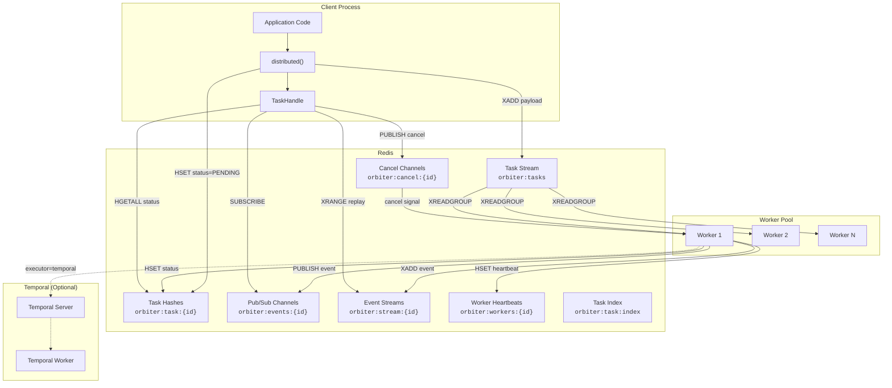
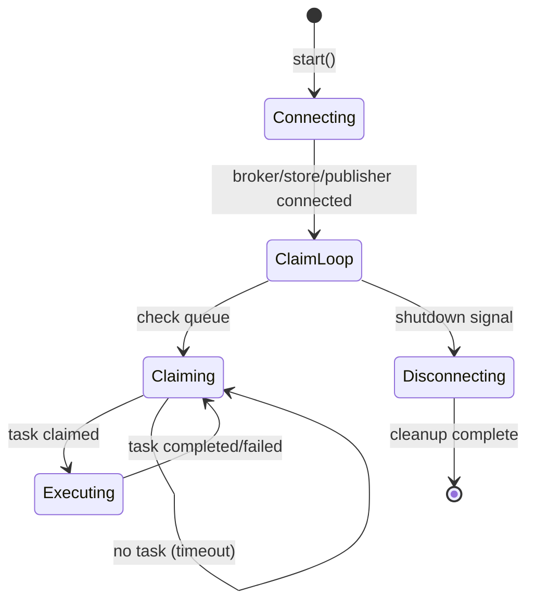
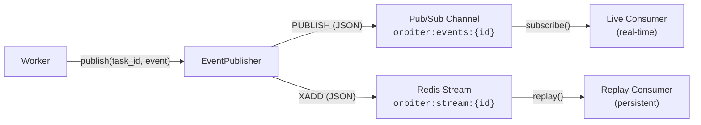
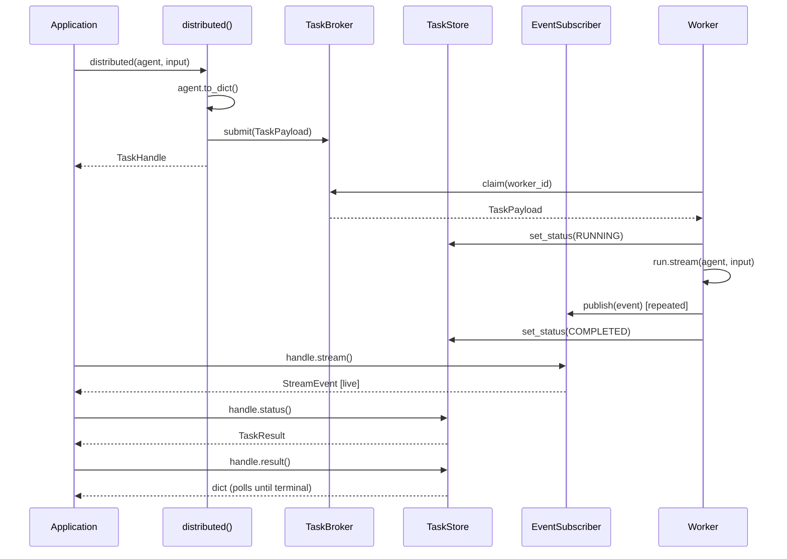
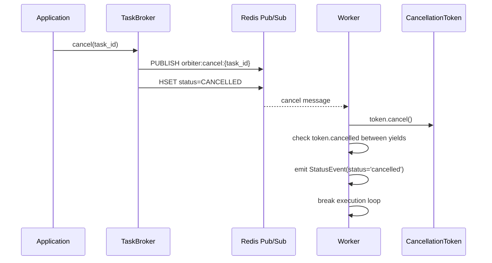

# Distributed Execution Architecture

This document describes the architecture of `orbiter-distributed`, which enables horizontal scaling of agent execution across multiple workers using Redis for task queuing, event streaming, and state management.

## System Architecture



## Component Descriptions

### TaskBroker (`broker.py`)

The task broker manages the Redis Streams-based task queue. It provides durable, multi-worker task distribution using consumer groups.

**Key operations:**

| Method | Redis Command | Description |
|--------|--------------|-------------|
| `connect()` | `XGROUP CREATE ... MKSTREAM` | Creates the consumer group and stream |
| `submit(task)` | `XADD` | Enqueues a serialized `TaskPayload` |
| `claim(worker_id)` | `XREADGROUP ... >` | Blocking pop for the next available task |
| `ack(task_id)` | `XACK` | Acknowledges successful processing |
| `nack(task_id)` | `XRANGE` + `XACK` + `XADD` | Re-enqueues a task for retry |
| `cancel(task_id)` | `PUBLISH` + `HSET` | Sends cancel signal and updates status |

**Consumer group model:** All workers join the same consumer group (`{queue_name}:group`). Redis distributes messages across consumers so each task is claimed by exactly one worker. The `>` special ID in `XREADGROUP` means "only new messages not yet delivered to this consumer."

### Worker (`worker.py`)

The worker is the core execution engine. It runs a claim-execute loop, processing tasks and publishing streaming events.

**Lifecycle:**



**Per-task execution flow:**

1. Claims task from queue via `TaskBroker.claim()`
2. Sets task status to `RUNNING` in `TaskStore`
3. Starts a cancel listener (Pub/Sub subscription on `orbiter:cancel:{task_id}`)
4. Reconstructs `Agent` or `Swarm` from `agent_config` via `from_dict()`
5. **Memory hydration** (if `task.metadata["memory"]` is present):
   - Creates a `MemoryStore` from the config (short-term, SQLite, or Postgres)
   - Attaches `MemoryPersistence` hooks for auto-saving AI/tool responses
   - Saves user input as `HumanMemory`
6. **Provider resolution**: uses `provider_factory(model)` if configured, otherwise auto-resolves
7. **Conversation history**: loads prior turns from the memory store (if present) and prepends to messages
8. Calls `run.stream(agent, input, detailed=task.detailed, provider=provider, messages=messages)`
9. Publishes each `StreamEvent` via `EventPublisher`
10. On completion: sets status to `COMPLETED`, acknowledges the task
11. On failure: sets status to `FAILED`, nacks if retries remain
12. On cancellation: sets status to `CANCELLED`, emits `StatusEvent(status='cancelled')`
13. Records metrics (duration, wait time, success/failure)
14. **Finally**: detaches memory persistence, tears down memory store, calls `on_task_done()`

**Concurrency:** The `concurrency` parameter spawns multiple `_claim_loop` coroutines, allowing a single worker process to execute multiple tasks in parallel.

**Heartbeat:** A separate Redis connection publishes health data to `orbiter:workers:{worker_id}` as a Redis hash with a configurable TTL (default 30s). The heartbeat fires every `heartbeat_ttl / 3` seconds.

### EventPublisher / EventSubscriber (`events.py`)

Events are published to two destinations for different consumption patterns:



| Channel | Redis Type | Use Case | Delivery |
|---------|-----------|----------|----------|
| `orbiter:events:{task_id}` | Pub/Sub | Live real-time events | At-most-once, only active subscribers |
| `orbiter:stream:{task_id}` | Stream | Replay / persistence | Durable, TTL-based expiry (default 1h) |

**Event deserialization:** Events are serialized as JSON with a `type` discriminator field. `_deserialize_event()` uses `_EVENT_TYPE_MAP` to reconstruct the correct Pydantic model from JSON.

**Subscriber termination:** `subscribe()` automatically ends the async iterator when a terminal `StatusEvent` is received (status is `completed`, `error`, or `cancelled`).

### TaskStore (`store.py`)

The task store tracks task status using Redis hashes with TTL-based auto-cleanup.

**Data model per task:**

| Redis Key | Type | Contents |
|-----------|------|----------|
| `orbiter:task:{task_id}` | Hash | `task_id`, `status`, `worker_id`, `started_at`, `completed_at`, `result` (JSON), `error`, `retries` |
| `orbiter:task:index` | Set | All known `task_id` values (for listing) |

Each hash has a configurable TTL (default 24h) set on every `set_status()` call. The secondary index set enables `list_tasks()` without scanning all Redis keys.

### TaskHandle / `distributed()` (`client.py`)

The `distributed()` function is the main public API. It serializes the agent, submits the task, and returns a `TaskHandle`.



**TaskHandle methods:**

| Method | Description |
|--------|-------------|
| `result()` | Polls `TaskStore` until terminal status, returns result dict |
| `stream()` | Yields live `StreamEvent` via Pub/Sub subscription |
| `cancel()` | Publishes cancel signal via `TaskBroker.cancel()` |
| `status()` | Returns current `TaskResult` from `TaskStore` |

### CancellationToken / Cancel Flow (`cancel.py`)

Cancellation is cooperative — the worker checks a `CancellationToken` between event yields during agent execution.



### TaskPayload / TaskResult / TaskStatus (`models.py`)

Frozen Pydantic `BaseModel` instances used as data carriers:

- **`TaskPayload`** — What gets queued: agent config, input, detailed flag, metadata, timeout
- **`TaskResult`** — Status tracking: status, result, error, timing, worker ID, retries
- **`TaskStatus`** — `StrEnum` with values: `PENDING`, `RUNNING`, `COMPLETED`, `FAILED`, `CANCELLED`, `RETRYING`

### Health Monitoring (`health.py`)

Workers publish health data via the heartbeat loop. The health system provides:

- **`WorkerHealth`** — Frozen dataclass with worker status, task counts, heartbeat timestamp
- **`WorkerHealthCheck`** — Implements `orbiter.observability.health.HealthCheck` protocol for integration with the observability stack
- **`get_worker_fleet_status()`** — Scans all `orbiter:workers:*` keys to return fleet-wide health; workers with heartbeat older than 60s are marked dead

### Metrics (`metrics.py`)

Records distributed task metrics using the `orbiter-observability` infrastructure (OTel when available, in-memory fallback otherwise):

| Metric | Type | Description |
|--------|------|-------------|
| `orbiter.distributed.tasks.submitted` | Counter | Tasks submitted to the queue |
| `orbiter.distributed.tasks.completed` | Counter | Successfully completed tasks |
| `orbiter.distributed.tasks.failed` | Counter | Failed tasks |
| `orbiter.distributed.tasks.cancelled` | Counter | Cancelled tasks |
| `orbiter.distributed.queue.depth` | Gauge | Current queue depth |
| `orbiter.distributed.task.duration` | Histogram | Task execution duration |
| `orbiter.distributed.task.wait_time` | Histogram | Time from submission to execution start |
| `orbiter.stream.events.emitted` | Counter | Streaming events emitted (by type) |
| `orbiter.stream.event.publish_duration` | Histogram | Event publish latency |

### Alerts (`alerts.py`)

Pre-defined alert rules registered with the global `AlertManager`:

| Rule | Threshold | Severity |
|------|-----------|----------|
| Queue depth high | > 100 | WARNING |
| Queue depth critical | > 500 | CRITICAL |
| Task failure rate | > 10% | WARNING |
| Worker count zero | = 0 | CRITICAL |
| Task wait time high | > 60s | WARNING |

### Tracing

Distributed tracing spans the full task lifecycle from submission to execution:

1. **Client side:** `distributed()` creates an `orbiter.distributed.submit` span and injects W3C Baggage context into `TaskPayload.metadata['trace_context']`
2. **Worker side:** `_execute_task()` extracts the trace context and creates a child `orbiter.distributed.execute` span linked to the submission span
3. **Inner execution:** Tool calls within the agent use the existing `@traced` decorator for nested spans

## Data Flow

### Redis-Only Mode

```
Client                          Redis                          Worker
  |                               |                              |
  |-- distributed(agent, input) ->|                              |
  |   XADD orbiter:tasks          |                              |
  |                               |<-- XREADGROUP (blocking) --- |
  |                               |--- TaskPayload ------------>|
  |                               |                              |
  |                               |<-- HSET RUNNING ----------- |
  |                               |<-- PUBLISH event ---------- |  (repeated per event)
  |                               |<-- XADD event ------------ |
  |<-- SUBSCRIBE events ---------|                              |
  |   StreamEvent (live)          |                              |
  |                               |<-- HSET COMPLETED --------- |
  |                               |<-- XACK ------------------- |
  |-- handle.result() ---------->|                              |
  |   HGETALL orbiter:task:{id}   |                              |
  |<-- TaskResult ---------------|                              |
```

### Redis + Temporal Mode

When `executor="temporal"` is set on the worker:

```
Client                    Redis              Worker              Temporal
  |                         |                  |                    |
  |-- distributed() ------->|                  |                    |
  |                         |<-- claim --------|                    |
  |                         |                  |-- start_workflow ->|
  |                         |                  |                    |
  |                         |                  |   execute_agent    |
  |                         |                  |   _activity()      |
  |                         |                  |<-- result ---------|
  |                         |<-- HSET done ----|                    |
  |<-- result --------------|                  |                    |
```

In Temporal mode, the worker submits a `AgentExecutionWorkflow` to Temporal instead of executing the agent directly. The Temporal activity (`execute_agent_activity`) reconstructs the agent, runs `run.stream()`, and heartbeats every 10 events. Temporal handles retries and state recovery on worker failure.

## Redis Data Structures Summary

| Key Pattern | Type | Purpose | TTL |
|-------------|------|---------|-----|
| `orbiter:tasks` | Stream | Task queue (consumer group) | None |
| `orbiter:tasks:group` | Consumer Group | Worker task distribution | N/A |
| `orbiter:task:{task_id}` | Hash | Task status and result | 24h |
| `orbiter:task:index` | Set | Task ID index for listing | None |
| `orbiter:events:{task_id}` | Pub/Sub Channel | Live event streaming | N/A |
| `orbiter:stream:{task_id}` | Stream | Persistent event replay | 1h |
| `orbiter:cancel:{task_id}` | Pub/Sub Channel | Cancel signal delivery | N/A |
| `orbiter:workers:{worker_id}` | Hash | Worker health/heartbeat | 30s |
